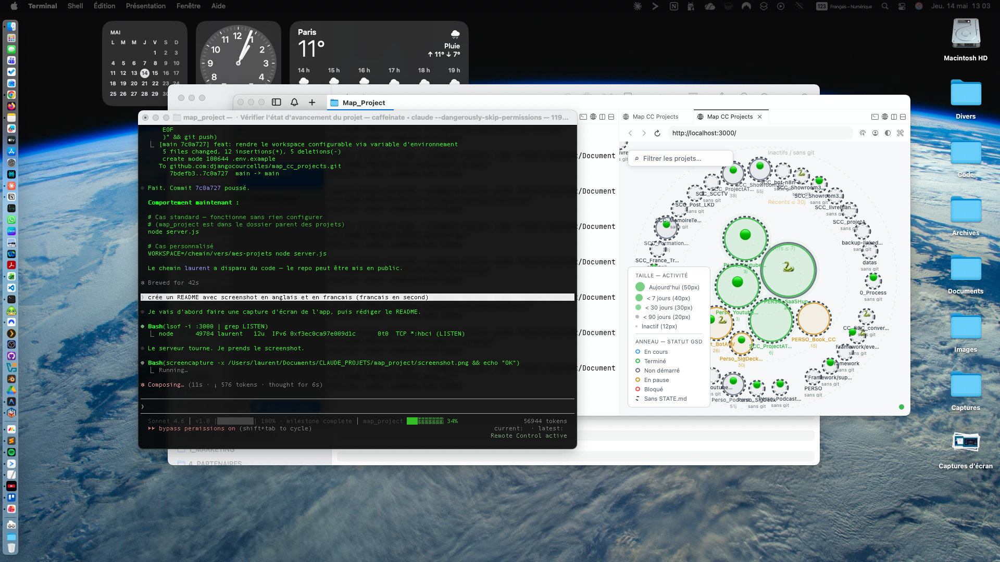

# Map CC Projects

An interactive force-graph that maps all your Claude Code projects at a glance — size, activity, tech stack, and GSD workflow status, live-updated via WebSocket.



---

## Features

- **Force-graph layout** — D3.js v7 bubble chart, draggable and zoomable
- **Activity encoding** — bubble size reflects days since last commit (today → large, inactive → small)
- **Tech stack detection** — auto-detected from `package.json`, `requirements.txt`, `Cargo.toml`, `go.mod`, etc.
- **GSD status ring** — dashed ring = no workflow, solid ring = GSD active, color = phase status
- **Live updates** — file watcher (chokidar) broadcasts changes via WebSocket; no page reload needed
- **Rich tooltip** — branch, last commit message, relative date, stack badges
- **Open in VS Code** — click any bubble to open the project in VS Code
- **Filter bar** — real-time search by name or stack
- **Dark / light theme** — toggle with one click
- **Persistent positions** — bubble layout saved in `localStorage`

## Requirements

- Node.js ≥ 20
- VS Code CLI (`code` command in PATH) — for the open-in-editor feature

## Installation

```bash
git clone https://github.com/djangocourcelles/map_cc_projects.git
cd map_cc_projects
npm install
node server.js
```

The browser opens automatically on `http://localhost:3000`.

## Configuration

By default the app scans the **parent directory** of `map_cc_projects` — no configuration needed if your projects sit alongside it.

To point to a different folder:

```bash
WORKSPACE=/path/to/your/projects node server.js
```

Or copy `.env.example` to `.env` and set `WORKSPACE` there.

| Variable    | Default                        | Description                        |
|-------------|--------------------------------|------------------------------------|
| `WORKSPACE` | parent directory of this repo  | Root folder containing your projects |
| `PORT`      | `3000`                         | HTTP server port                   |

## How it works

```
chokidar (file watcher)
    └── STATE.md / COMMIT_EDITMSG / CLAUDE.md changes
            └── scanner.js rescans workspace
                    └── WebSocket broadcast → D3 updates in place
```

1. `server.js` — HTTP server + WebSocket server, serves static files and `/api/projects`
2. `scanner.js` — reads each project directory, extracts git metadata and GSD state
3. `watcher.js` — chokidar watches relevant files, debounces (500 ms), triggers rescan + broadcast
4. `public/index.html` — D3.js force simulation, all frontend logic

## Project structure

```
map_cc_projects/
├── server.js          # HTTP + WebSocket entry point
├── scanner.js         # Workspace scanner → ProjectRecord[]
├── watcher.js         # chokidar + debounce + WS broadcast
├── public/
│   ├── index.html     # Full frontend (vanilla JS + D3)
│   └── lib/
│       └── d3.min.js  # Vendored D3 v7
└── .env.example       # Configuration template
```

## License

MIT

---

---

# Map CC Projects *(français)*

Une carte interactive en graphe de forces qui visualise tous vos projets Claude Code en un coup d'œil : taille, activité, stack technique et statut de workflow GSD, mis à jour en temps réel via WebSocket.

## Fonctionnalités

- **Graphe de forces D3.js v7** — bulles déplaçables et zoomables
- **Encodage de l'activité** — la taille de la bulle reflète le nombre de jours depuis le dernier commit
- **Détection de stack** — auto-détectée depuis `package.json`, `requirements.txt`, `Cargo.toml`, `go.mod`, etc.
- **Anneau GSD** — anneau tireté = pas de workflow, anneau plein = GSD actif, couleur = statut de phase
- **Mises à jour en direct** — le watcher (chokidar) diffuse les changements via WebSocket sans rechargement
- **Tooltip riche** — branche, dernier message de commit, date relative, badges de stack
- **Ouvrir dans VS Code** — cliquer sur une bulle ouvre le projet dans VS Code
- **Barre de filtrage** — recherche en temps réel par nom ou stack
- **Thème sombre / clair** — bascule en un clic
- **Positions persistantes** — la disposition des bulles est sauvegardée dans `localStorage`

## Prérequis

- Node.js ≥ 20
- CLI VS Code (commande `code` dans le PATH) — pour l'ouverture dans l'éditeur

## Installation

```bash
git clone https://github.com/djangocourcelles/map_cc_projects.git
cd map_cc_projects
npm install
node server.js
```

Le navigateur s'ouvre automatiquement sur `http://localhost:3000`.

## Configuration

Par défaut, l'application scanne le **répertoire parent** de `map_cc_projects` — aucune configuration nécessaire si vos projets se trouvent à côté.

Pour pointer vers un autre dossier :

```bash
WORKSPACE=/chemin/vers/vos-projets node server.js
```

Ou copiez `.env.example` vers `.env` et renseignez `WORKSPACE`.
