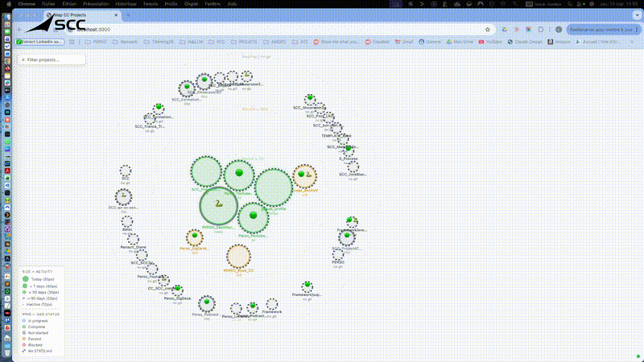

# Map CC Projects

An interactive force-graph that maps all your **[Claude Code](https://claude.ai/code)** projects at a glance — size, activity, tech stack, and GSD workflow status, live-updated via WebSocket.

> **Claude Code** is Anthropic's CLI for AI-assisted software development. If you work on multiple Claude Code projects, this tool gives you a real-time overview of all of them in a single browser tab.



---

## Features

- **Force-graph layout** — D3.js v7 bubble chart, draggable and zoomable
- **Activity encoding** — bubble size reflects days since last commit (today → large, inactive → small)
- **Tech stack detection** — auto-detected from `package.json`, `requirements.txt`, `Cargo.toml`, `go.mod`, etc.
- **GSD status ring** — each bubble shows a colored ring reflecting the GSD workflow phase status (in progress, complete, paused…); dashed = no workflow file
- **Live updates** — file watcher (chokidar) broadcasts changes via WebSocket; no page reload needed
- **Rich tooltip** — branch, last commit message, relative date, stack badges
- **Open in VS Code** — click any bubble to open the project in VS Code
- **Filter bar** — real-time search by name or stack
- **Dark / light theme** — follows your system preference (`prefers-color-scheme`)
- **Persistent positions** — bubble layout saved in `localStorage`

## Requirements

- Node.js ≥ 20
- VS Code with the `code` CLI in PATH — to enable click-to-open. Install it from VS Code: `⌘⇧P` → *Shell Command: Install 'code' command in PATH*

## Installation

```bash
git clone https://github.com/djangocourcelles/map_cc_projects.git
cd map_cc_projects
npm install
node server.js
```

The browser opens automatically on `http://localhost:3000`.

## Configuration

By default the app scans the **parent directory** of `map_cc_projects` — no configuration needed if your projects sit alongside it.

To point to a different folder:

```bash
WORKSPACE=/path/to/your/projects node server.js
```

Or copy `.env.example` to `.env` and set `WORKSPACE` there.

| Variable    | Default                        | Description                        |
|-------------|--------------------------------|------------------------------------|
| `WORKSPACE` | parent directory of this repo  | Root folder containing your projects |
| `PORT`      | `3000`                         | HTTP server port                   |

## What is GSD?

GSD (Get Shit Done) is a lightweight project management workflow for Claude Code. Each project stores its current phase and status in a `.planning/STATE.md` file. Map CC Projects reads that file to color-code the ring around each bubble:

| Ring color | Status |
|------------|--------|
| 🔵 Blue | In progress |
| 🟢 Green | Complete |
| ⚪ Grey | Not started |
| 🟡 Yellow | Paused |
| 🔴 Red | Blocked |
| Dashed | No STATE.md (no workflow) |

No GSD? The map still works — you just won't see colored rings.

## How it works

```
chokidar (file watcher)
    └── STATE.md / COMMIT_EDITMSG / CLAUDE.md changes
            └── scanner.js rescans workspace
                    └── WebSocket broadcast → D3 updates in place
```

1. `server.js` — HTTP server + WebSocket server, serves static files and `/api/projects`
2. `scanner.js` — reads each project directory, extracts git metadata and GSD state
3. `watcher.js` — chokidar watches relevant files, debounces (500 ms), triggers rescan + broadcast
4. `public/index.html` — D3.js force simulation, all frontend logic

## Project structure

```
map_cc_projects/
├── server.js          # HTTP + WebSocket entry point
├── scanner.js         # Workspace scanner → ProjectRecord[]
├── watcher.js         # chokidar + debounce + WS broadcast
├── public/
│   ├── index.html     # Full frontend (vanilla JS + D3)
│   └── lib/
│       └── d3.min.js  # Vendored D3 v7
└── .env.example       # Configuration template
```

## License

MIT

---

---

# Map CC Projects *(français)*

Une carte interactive en graphe de forces qui visualise tous vos projets **[Claude Code](https://claude.ai/code)** en un coup d'œil : taille, activité, stack technique et statut de workflow GSD, mis à jour en temps réel via WebSocket.

> **Claude Code** est le CLI d'Anthropic pour le développement assisté par IA. Si vous travaillez sur plusieurs projets Claude Code, cet outil vous en donne une vue d'ensemble en temps réel dans un seul onglet.

## Fonctionnalités

- **Graphe de forces D3.js v7** — bulles déplaçables et zoomables
- **Encodage de l'activité** — la taille de la bulle reflète le nombre de jours depuis le dernier commit
- **Détection de stack** — auto-détectée depuis `package.json`, `requirements.txt`, `Cargo.toml`, `go.mod`, etc.
- **Anneau GSD** — chaque bulle affiche un anneau coloré selon le statut de phase GSD (en cours, terminé, en pause…) ; tireté = pas de fichier STATE.md
- **Mises à jour en direct** — le watcher (chokidar) diffuse les changements via WebSocket sans rechargement
- **Tooltip riche** — branche, dernier message de commit, date relative, badges de stack
- **Ouvrir dans VS Code** — cliquer sur une bulle ouvre le projet dans VS Code
- **Barre de filtrage** — recherche en temps réel par nom ou stack
- **Thème sombre / clair** — suit la préférence système (`prefers-color-scheme`)
- **Positions persistantes** — la disposition des bulles est sauvegardée dans `localStorage`

## Prérequis

- Node.js ≥ 20
- VS Code avec la commande `code` dans le PATH — pour l'ouverture au clic. À installer depuis VS Code : `⌘⇧P` → *Shell Command: Install 'code' command in PATH*

## Installation

```bash
git clone https://github.com/djangocourcelles/map_cc_projects.git
cd map_cc_projects
npm install
node server.js
```

Le navigateur s'ouvre automatiquement sur `http://localhost:3000`.

## Configuration

Par défaut, l'application scanne le **répertoire parent** de `map_cc_projects` — aucune configuration nécessaire si vos projets se trouvent à côté.

Pour pointer vers un autre dossier :

```bash
WORKSPACE=/chemin/vers/vos-projets node server.js
```

Ou copiez `.env.example` vers `.env` et renseignez `WORKSPACE`.
